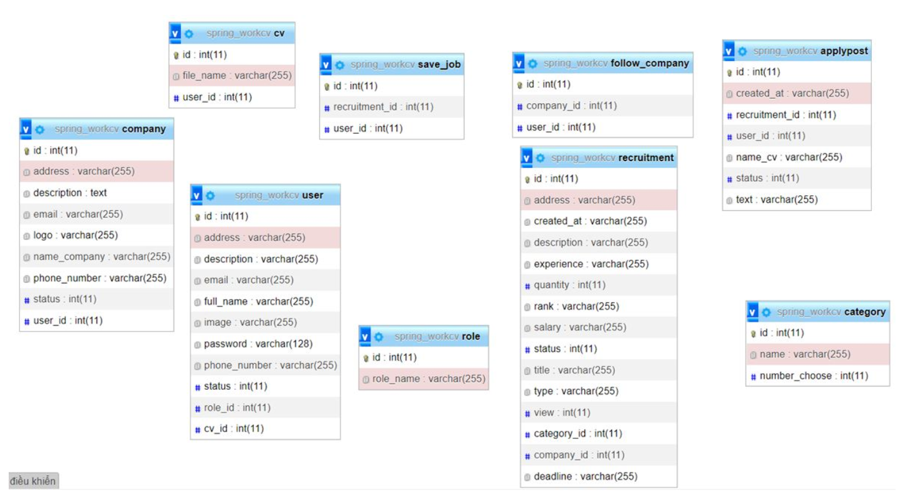

Project Web tìm kiếm việc làm
Web được phát triển bằng ngôn ngữ Java và Spring MVC
1. Cơ sở dữ liệu
    
2. Tổ chức dự án
    
3. Các chức năng
 - Hiển thị các công ty nổi bật và hiển thị các việc làm nổi bật (mới nhất)
    
 - Hiển thị top danh mục công việc
    
 - Đăng nhập hệ thống sử dụng Spring Sercurity
    
 - Đăng ký hệ thống
    
 - Đăng xuất hệ thống
    
 - Cập nhật thông tin cá nhân và công ty
    
    
 - Quản lý đăng tin tuyển dụng (Hiển thị các bài đăng)
    
 - Quản lý đăng tin tuyển dụng (Thêm mới thông tin tuyển dụng)
    
 - Quản lý đăng tin tuyển dụng (Chỉnh sửa thông tin tuyển dụng)
    
 - Quản lý đăng tin tuyển dụng (Xóa thông tin tuyển dụng)
    
 - Quản lý ứng viên (Danh sách ứng viên)
    
    
 - Chức năng tạo CV (Upload file pdf) lên Cloudinary
    
 - Ứng tuyển vào công việc
    
    
    
 - Gửi email khi đăng ký để xác thực tài khoản
    
 - Theo dõi công việc, theo dõi công ty
    
    
 - Xem danh sách công việc đã lưu/đã ứng tuyển
    
 - Quản lý các việc/công ty đã theo dõi
    
    
